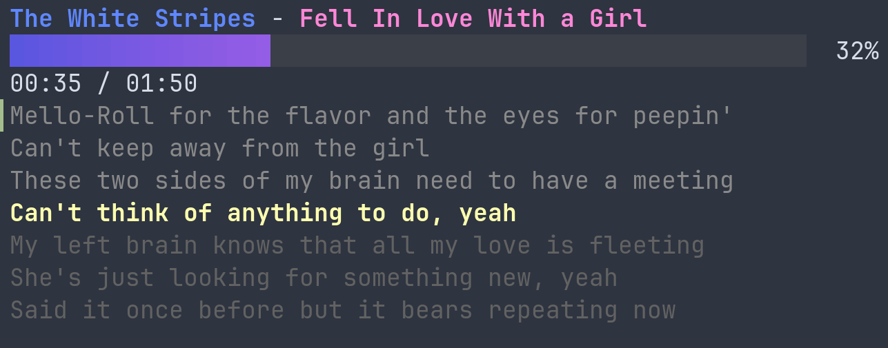

# Goraoke

Terminal karaoke-style lyrics display for the track currently playing in `cmus`, using a local SQLite copy of the [LRCLib](https://lrclib.net) lyrics database.

<p align="center">
   
</p>

## Features
- Polls `cmus` (`cmus-remote -Q`) for currently playing track (artist, title, position, duration).
- Looks up synced (LRC-style) or plain lyrics in a local SQLite database.
- Renders a progress bar and a small scrolling window around the current lyric line (Bubble Tea / Bubbles / Lip Gloss UI stack).

## Requirements
- Go (matching the version in `go.mod`).
- `cmus` installed and running with a playing track.
- A local SQLite lyrics database at `lyrics/music.sqlite3` (see below to obtain from LRCLib dumps).

## Getting the Lyrics Database
This project expects a SQLite database with tables (`tracks`, `lyrics`, etc.) matching the LRCLib public dump schema (see `lyrics/structure.sql` for reference). The actual database file is **not** committed (see `lyrics/.gitignore`).

1. Visit: https://lrclib.net/db-dumps
2. Download the latest SQLite dump/archive (LRCLib periodically publishes dumps; formats have included compressed SQLite files or SQL dump archives). Assume you obtain a file named similar to:
   - `lrclib-sqlite-YYYYMMDD.sqlite.zst` (compressed SQLite) **or**
   - `lrclib-sqlite-YYYYMMDD.sqlite.gz` **or**
   - An SQL dump like `lrclib-sql-dump-YYYYMMDD.sql.zst`
3. Decompress it (examples):

```bash
# Zstandard-compressed SQLite file
tar --help >/dev/null 2>&1  # ensure basic tools exist
unzstd lrclib-sqlite-*.sqlite.zst
# or
zstd -d lrclib-sqlite-*.sqlite.zst

# Gzip
gunzip lrclib-sqlite-*.sqlite.gz

# If you received a .sql(.zst/.gz) dump instead of a ready .sqlite file:
#   1. Decompress to get plain .sql
#   2. Import into new SQLite DB
sqlite3 music.sqlite3 < lrclib-dump-*.sql
```

4. Place / rename the resulting SQLite file as:

```bash
mkdir -p lyrics
mv lrclib-sqlite-*.sqlite lyrics/music.sqlite3
```

5. (Optional) Verify schema alignment:

```bash
sqlite3 lyrics/music.sqlite3 '.schema tracks' | head
```

If the schema deviates, adapt the query in `main.go` (`queryLyrics`) accordingly.

### Updating the Database
Repeat the above steps with a newer dump and overwrite `lyrics/music.sqlite3` while the program is not running.

### Size & Storage
The full LRCLib dump can be large. You may want to keep it outside the repo and symlink:

```bash
ln -s /path/to/lrclib.sqlite lyrics/music.sqlite3
```

## Building

```bash
go build -o goraoke ./...
```

(Or run directly with `go run .`).

## Running
Start `cmus` and begin playback, then:

```bash
./goraoke
```

Quit with `q` or `Ctrl+C`.

## How It Works (Brief)
- On a timer tick, runs `cmus-remote -Q` and parses artist/title/duration/position.
- On track change, queries the SQLite DB for a matching (artist_lower, name_lower, duration) row; falls back to ignoring duration if no exact match.
- If synced lyrics exist (`synced_lyrics`), parses basic LRC timestamps (`[mm:ss.xx]`) and displays a sliding window.

## Development Notes
- Schema sample: `lyrics/structure.sql` (for reference only; may lag behind the official LRCLib dump).
- Minimal SQL lookup example: `lyrics/find_track.sql`.
- The code intentionally uses a tiny custom insertion sort for the usually small lyric line slice to avoid additional imports.

## Troubleshooting
| Symptom | Cause / Fix |
|---------|-------------|
| "Waiting for cmus..." | `cmus` not running or nothing playing. Start playback. |
| "(searching lyrics...)" persists | No DB file at `lyrics/music.sqlite3` or query mismatch (check lowercasing, duration). |
| "(no lyrics)" | Track found but neither `plain_lyrics` nor `synced_lyrics` populated. |
| Error about opening DB | Wrong path or permissions; ensure file exists and readable. |

## License / Data Attribution
Application source under your chosen license (add one—e.g., MIT). LRCLib data is community-sourced; review LRCLib terms before redistribution. Do **not** commit the downloaded database file to this repository.

## Future Ideas
- Fuzzy matching / duration tolerance window.
- Better handling of multiple timestamps with millisecond precision.
- Live fetch from LRCLib API when local miss occurs.
- Color/theme customization flags.

---
Enjoy singing!
